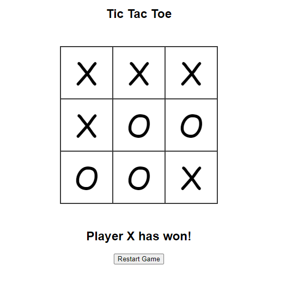
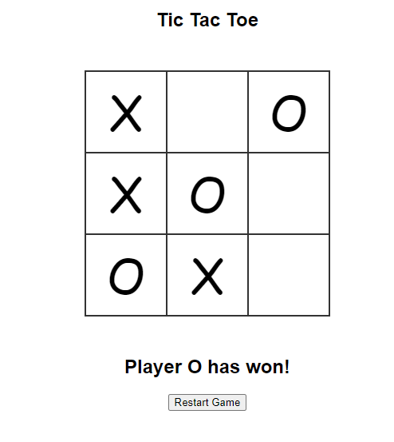

# Tic Tac Toe

## **Developer**:

Dhananjay Mahtha -
<a href="https://www.linkedin.com/in/dhananjay-kumar-706643165/" target="_blank">LinkedIn</a> <a href="https://github.com/dhananjay8968" target="_blank">Github</a>

## **Tech Stack**:

1. HTML
2. CSS
3. Javascript

## **How to run**

1. Clone the repositry to Local System
2. Go to Tic Tac Toe folder.
3. Open index.html

## **Screenshot**

\
\

    
